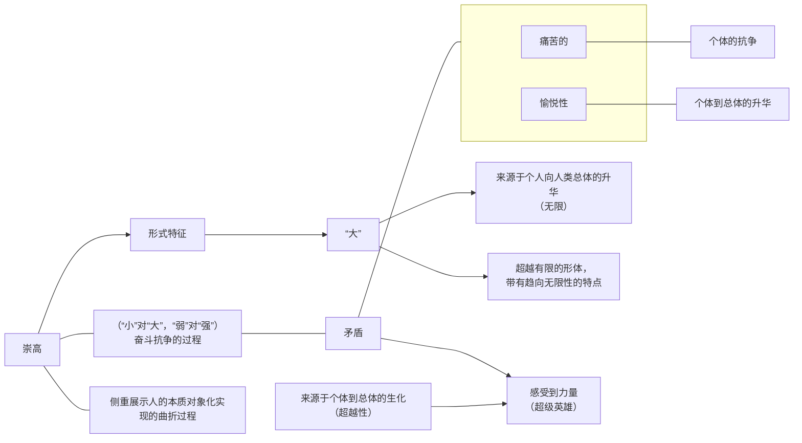
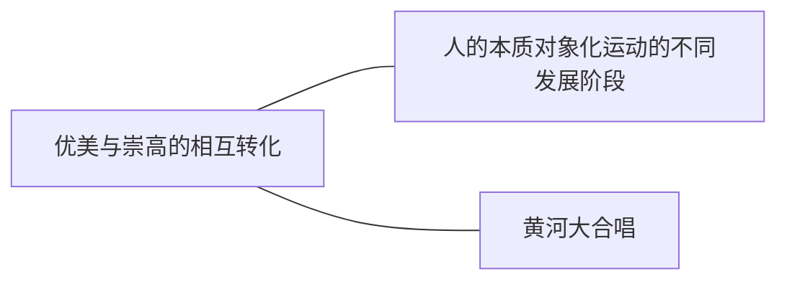
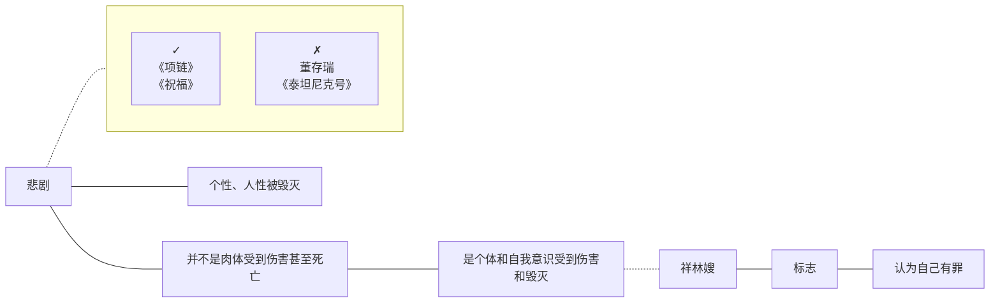
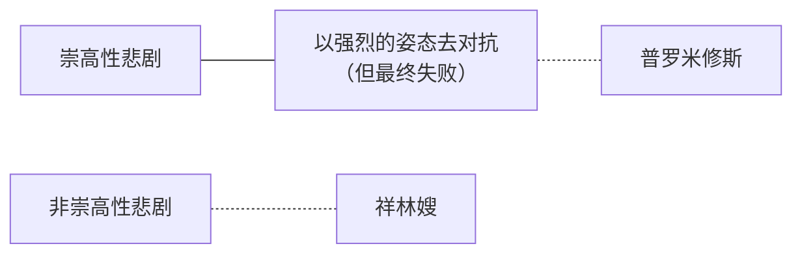
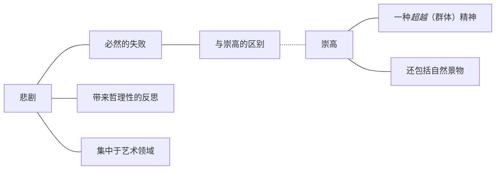
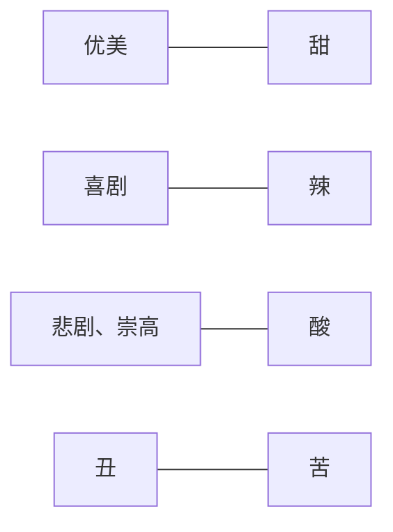
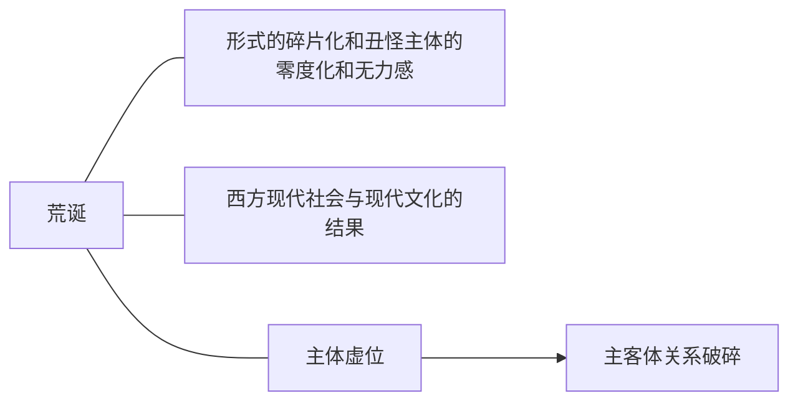

# 第八章 审美范畴

### 优美

狭义的美：古希腊的美，优美

广义的美：包含一切事物的美

_人的本质_力量的对象化

> "人的本质" --- 精神力，审美力

> 优美不是完美
>
> > 有缺陷
> >
> > 有“矛盾感”

优美主客体始终统一

### 崇高

***

常态：崇高 --> 优美

### 悲剧

悲剧快感来自于\*“怜悯与恐惧”\* ----亚里士多德

> * 本质
> * 特征
> * 与崇高的关系

审美中的悲剧 --- 人的本质对象化过程中的一个阶段

现实生活中的悲剧事件不能作为_审美中的悲剧_（因为伦理）

> "审美中的悲剧" --- 一般存在与艺术中

#### 本质

#### 特征

> *   悲剧人物：
>
>     值得同情和认同的个性化人物
>
>     > （会犯错的好人）
>     >
>     > \----亚里士多德
> *   悲剧条件：
>
>     使个性毁灭，或自由自觉的人性受到伤害
> *   悲剧特征：
>
>     不可避免、不正当的
>
>     > （祥林嫂价值的实现依托于鲁四姥爷家）
> *   悲剧效果：
>
>     不只是作为旁观者，怜悯、恐惧
>
>     \--> 精神提升

#### 关系

***

***

### 丑

为什么丑会成为审美范畴中重要的审美形态

丑是现实对人本质的否定，是目的性和规律性的不统一

#### 丑的审美价值

1. 对比和陪衬美的价值
2.  丰富和激活美的价值

    丰富和扩展了美的内涵和范围
3.  丑的审美意义

    > * 负值效应
    > * 补充性思维
    > * 解放性思维和去蔽性思维
4. 丑学的现实意义

***

> - ***
> - ***
> - ***
> - ***

> 荒诞

