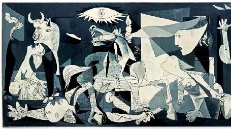
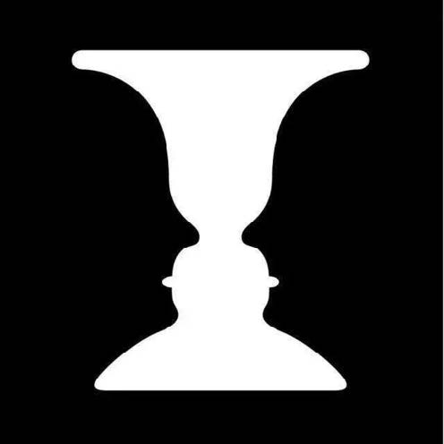
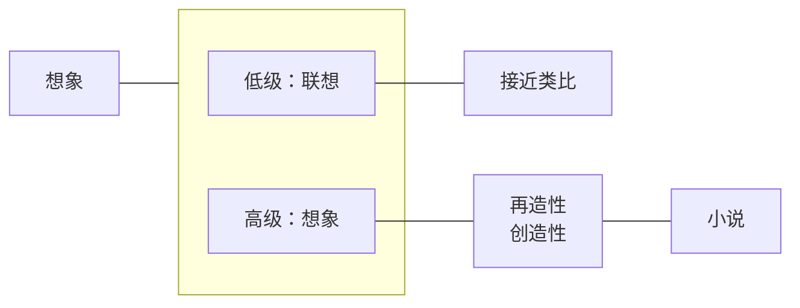
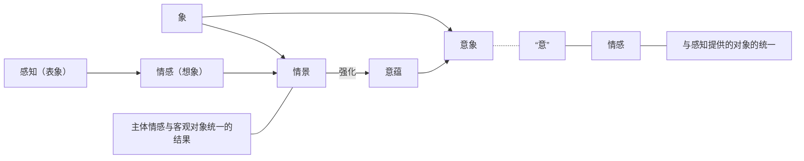
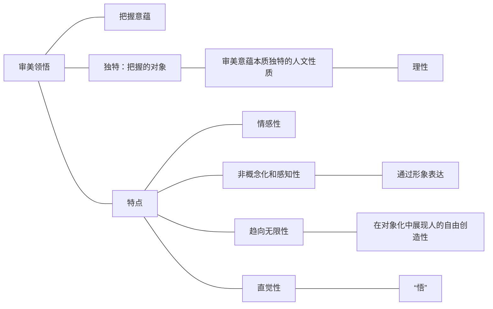
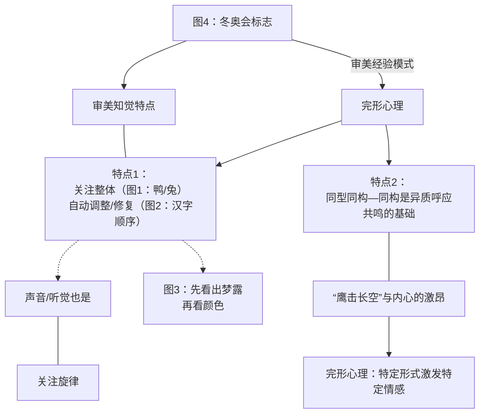
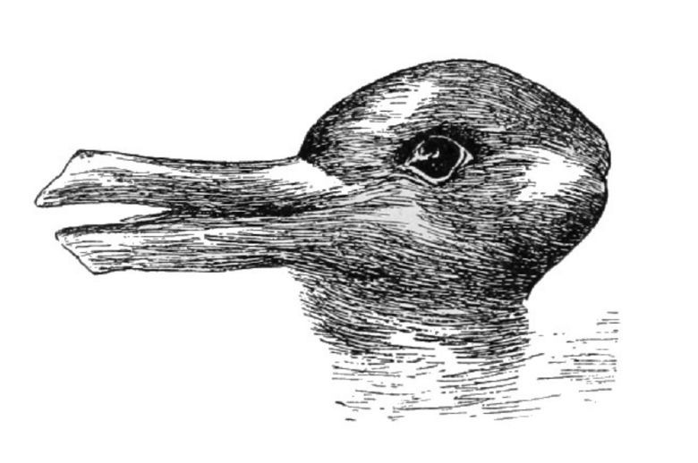
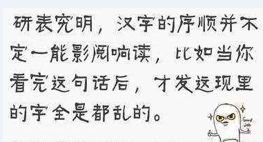
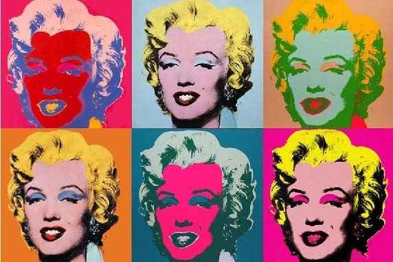
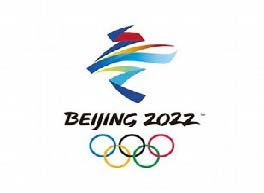

# 第二章 审美能力

审美感知

> 难 --- 审美知觉
>
> 重 --- 审美领悟

* 感觉 --- 对个别感性属性的感受
*   知觉：<mark style="color:yellow;">**star**</mark> **把感觉的材料联合为完整性对象 （--- 脑补）**

    > <mark style="color:yellow;">**star**</mark> <-- **先感知到整体**

> * 局部/整体 <-- 感觉 --> 质料
> *   整体    <--- 知觉 --> 形式
>
>     > 知觉 --难分--> 感知力

格尔尼卡、毕加索（画）

> <==> 知觉
>
> > 

审美知觉具有_选择性_

> （区别一般知觉）

> "选择性" --> 人脸杯
>
> > 

> new
>
> * 感知力 --- （难）
> * 想象力
> * 领悟力
> * 经验模式 --- （重）

### 审美想象

> 个体 --> 群体
>
> 突出主体能动性

#### 科学想象/审美想象 区别

1. 有/无 功利性目的
2.  _客观_/_主观_性 的

    > "客观" --- 客观规律
    >
    > "主观" --- 按情感要求展开
3.  概念化，公式化/_有明确意向_又_无确定概念_

    > "有明确意向" --- 毛泽东“鹰击长空”
    >
    > "无确定概念" --- 遵从主体

### 审美领悟

### 审美经验模式

#### 审美体验

> * 以身“体”之 --- （演员下生活）
> * 以心“验”之

基本特征

> * 源初性 --- 音乐来自劳动号子
> * 亲历性 --- 看电影分享不出真正的观感
> * 整体性 --- 音乐有无画面的区别

#### 审美注意

> 审美注意 --> <mark style="color:yellow;">**star**</mark> **审美的态度直接超越直接的功利性**

> * 客体吸引主体注意
> * 主体具有注意力

> * 情绪的注意（不随意注意）
> * 对对象的一种情感上的渴求（特殊的情感指向）
> * 审美活动的必要前提

#### 审美心理距离

在对自然物和艺术品的欣赏中，人们需要保持一种心理距离

> 拉开距离 --> 超功利

#### 审美移情

> *   由我及物（情感或感受从自我向对象投射）
>
>     > “感时花溅泪”
> * 由物及我

#### 完形心理

<figure><figcaption>
图1：鸭兔
</figcaption></figure>

<figure><figcaption>
图2：汉字顺序
</figcaption></figure>

<figure><figcaption>
图3：梦露
</figcaption></figure>

<figure><figcaption>
图4：冬奥会标志
</figcaption></figure>
