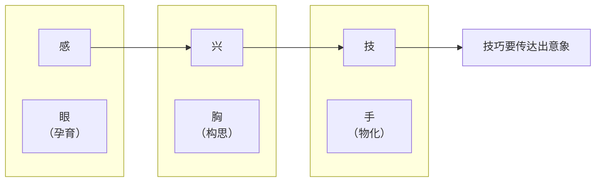
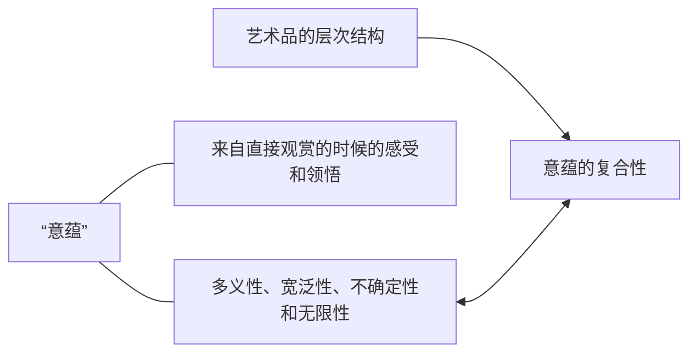
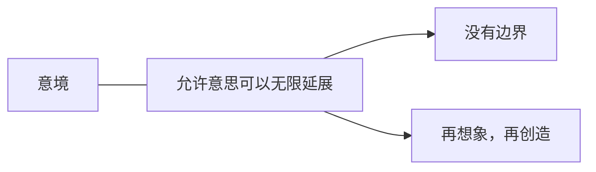
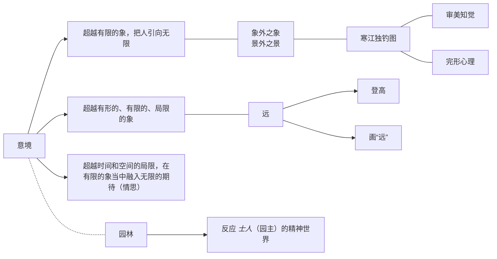
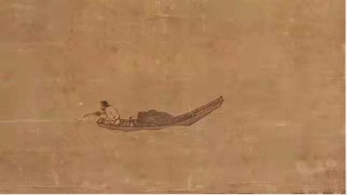
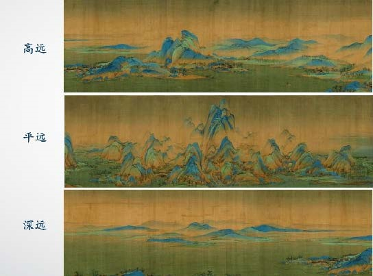

# 第六章 艺术美

> 艺术与非艺术
>
> 是否可以\*“兴”\*
>
> > "兴" --> 呈现一个意象世界

> **“胸有成竹”**

### 艺术品的层次结构

> *   材料层（--- 质感） --- 言
>
>     > 
> *   形式层 --- 象 ------ _形式_世界
>
>     > "形式" --- 戏曲 --> 程式
> * 意蕴层 --- 意

“意蕴”是美感的对象

### 意_境_

> "境" --- 边界

意境 --- 意象运载量伸缩张力的大小

<figure><figcaption>
寒江独钓图
</figcaption></figure>

<figure><figcaption>
远
</figcaption></figure>

> 艺术是发展的，可能今天是，明天不是
