# 第七章 审美本质

柏拉图 --- 美是_理式_ （理念）

> "理式" --- 美本身超越“美的事物”

> 物质 --- 美如何存在

```mermaid
flowchart LR
感官判断 --> 由愉快而生的判断
道德判断 --> 由愉快而生的判断
美 --- 情感判断 --> 由判断而生的愉快
```

> 审美“无利害而生愉悦”
>
> \--> 美感具有普遍性

> 审美 --- 无目的的含目的性
>
> \--> 踏歌：没有人看/不是为了给人看，却因来到山间不自觉地载歌载舞
>
> 

马克思“美的规律”思想

美是一种价值

> 中国：
>
> > 孔子：以和为美
> >
> > “美”与“善”的统一
> >
> > “文”与“质”的统一
>
> > 孟子：充实为美
> >
> > “善养吾浩然之气”
> >
> > \--- 人格修养感性化
>
> > 道家：强调道对审美表_象_的本体意义
> >
> > \---> 与儒家不同
> >
> > > "象" --- 大象无形

> 美 --- _主客观_统一说
>
> > "主客观" --- “心”与“物”
>
> 主客观统一说 --- 美在意象 --- 否定主客观对立

|             |                            |
| ----------- | -------------------------- |
| 见山是山，见水是水   | 我知道我知道                     |
| 见山不是山，见水不是水 | 绝对自我，否定外物；我不知道我知道，只知道自己    |
| 见山还是山，见水还是水 | “心不自心，因色故有”，心灵与自然融合为一（山水画） |
