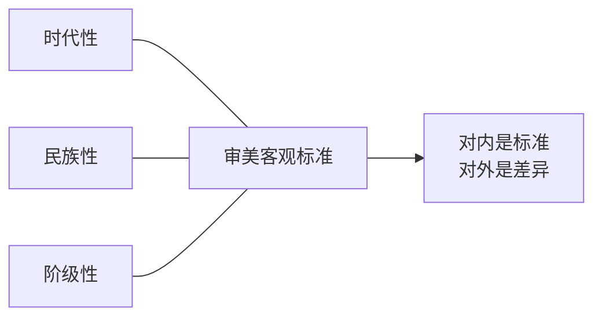
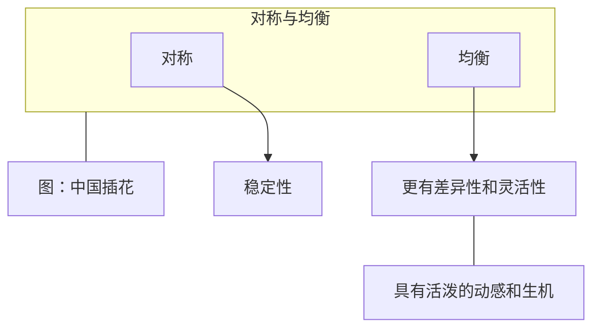

# 第三章 审美标准


（二 5 & 三 1 2 3）


### 审美经验的_历史演变_与_文化差异_/文化模式

> * 历史演变 --> 纵向
> * 文化差异 --> 横向 --- 地域性

审美体验的客观标准与个性差异

### 形式美的构成要素

色、形、声、质、味

### 形式美的_基本规律_（法则）

> "基本规律" --> 普遍特征

> * 对称与均衡
> * 调和与对比
> * 比例与尺度
> * 节奏与韵律
> * 多样与统一

#### 对称与均衡

<figure><figcaption>
对称
</figcaption></figure>

<figure><figcaption>
图：中国插花
</figcaption></figure>
