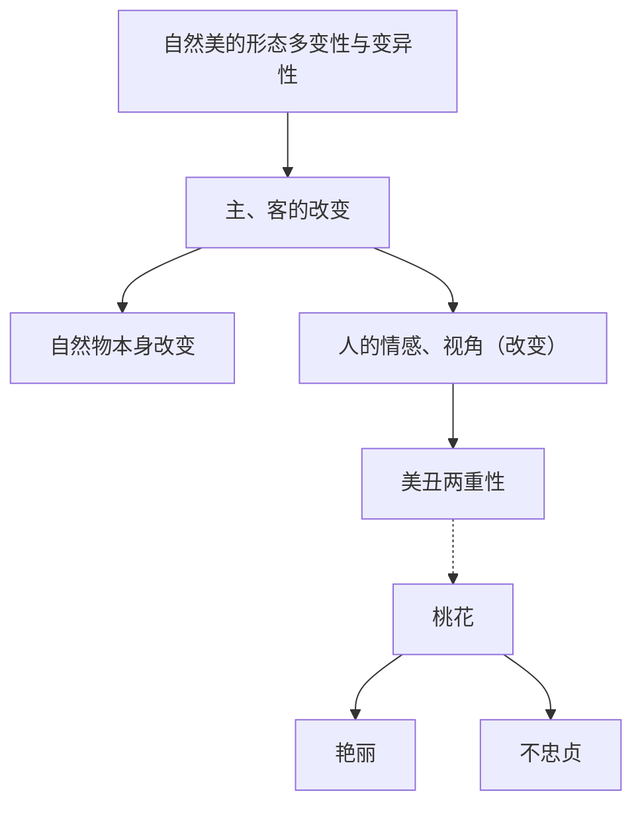
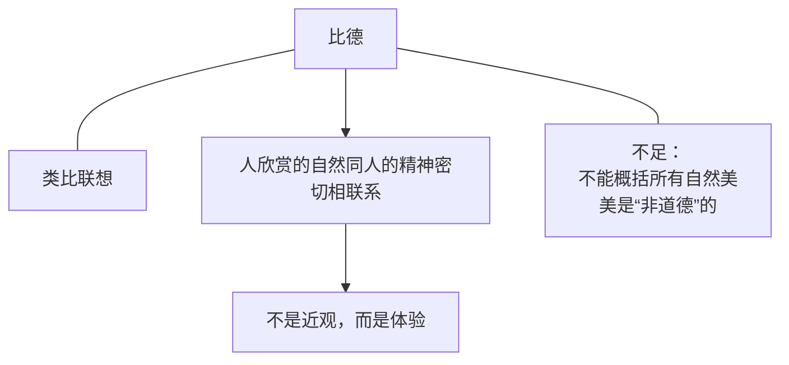
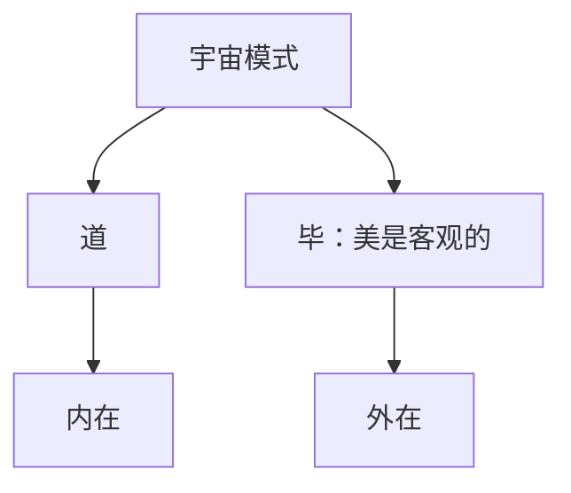
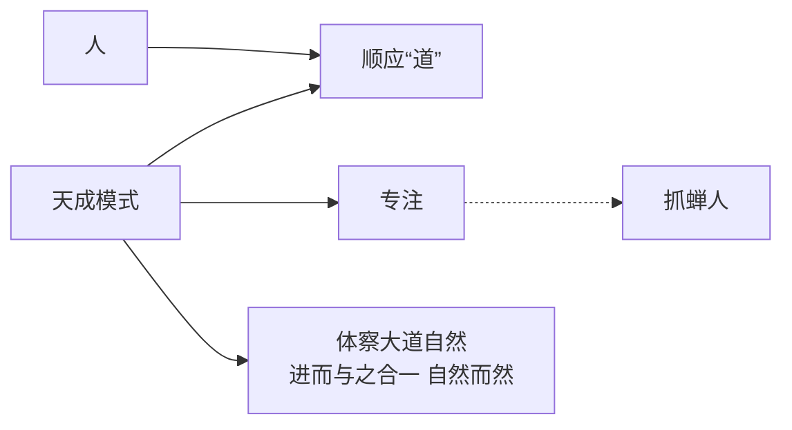
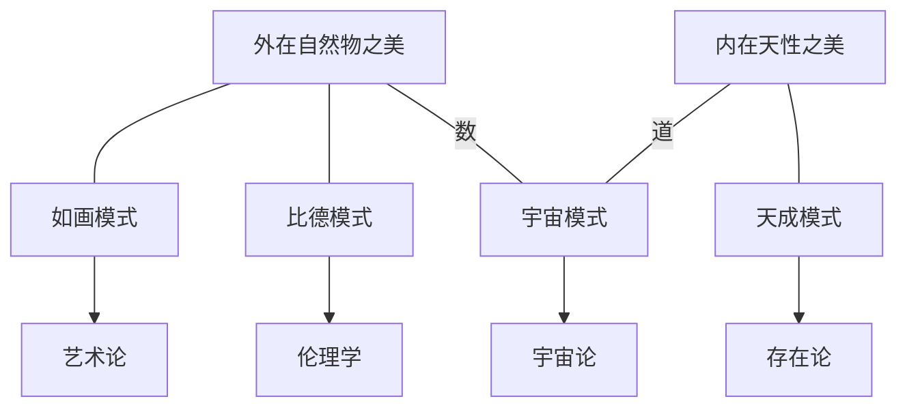

# 第四章 自然美

> "自然审美" --> 偏重于_**形式**_，而非内容
>
> > "形式" --> 鹤、癞蛤蟆

> "朦胧" --- 说不清具体内容

#### 3. 自然美的形态多变性与变异性

#### 4. 自然审美的_<mark style="color:yellow;">**处身性**</mark>_和不可传递性

> 艺术审美 --> 分离式&#x20;
>
> 自然审美 --> 介入式

### 自然美的代表性模式

> * 如画模式
> * 比德模式
> * 宇宙模式
> * 天成模式

#### 如画模式

如画 --- 以艺术角度关照自然

局限/不足：忽略了**处身性和...**

#### 比德模式

#### 宇宙模式

#### 天成模式

#### 总结

