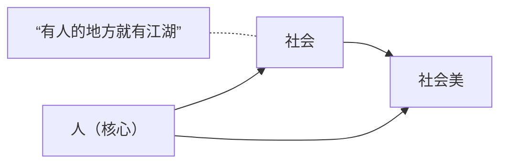

# 第五章 社会美

### _社会美_的_范围_与_特征_

> "社会美" --> 符合人类**实践活动**需要，体现出人类正面的价值追求

> "范围"
>
> > 实践活动范围 --决定和影响--> 社会美的_**范围**_ （什么人，做了什么事，得到了什么结果）
> >
> > > "范围"
> > >
> > > > 扩大了...（实用物的美，...相互渗透）

#### 社会美的范围

> > > "社会美的范围"
> > >
> > > > * 社会实践_活动_的美
> > > > *   \~_成果_的美
> > > >
> > > >     > <mark style="color:yellow;">**star**</mark> **理解社会美美感的来源**
> > > >
> > > >     > **人类社会实践的对象化形态**
> > > >     >
> > > >     > > （包括人文环境...，如：博物馆_文物_）
> > > >     > >
> > > >     > > > "文物" --> 人类的创造性、智慧
> > > >     >
> > > >     > 马克思 --- \~\~对象化形态
> > > >     >
> > > >     > > <mark style="color:yellow;">**美 <--**</mark><mark style="color:yellow;">** **</mark>_<mark style="color:yellow;">**人的本质力量**</mark>_<mark style="color:yellow;">**对象化**</mark>
> > > >     > >
> > > >     > > > "人的本质力量" --> （个性、生命力）
> > > >     > >
> > > >     > > 理解马克思 --> 理解社会美
> > > > *   \~_主体_的美
> > > >
> > > >     > \--> 人的美

#### 特征

> "特征"
>
> > 1 \~是人类社会实践产物的最直接的物质存在形式
> >
> > 2 \~直接体现了人的_自由自觉的特性_
> >
> > > "自由自觉" <-- 有意识地开展实践
> >
> > 3 功利性，价值取向
> >
> > > \--> 关照的不是形式，而是背后的内涵
> >
> > 4 形式从属于内容

### 社会交往与人物美

> * 语言美
> * 形体交际美
> * 心灵交融美

人物美

> *   人体美
>
>     > <-- 受到自然因素影响（肤色）
>     >
>     > \--> 最终显现出的是人的_**感性生命**_（的力量）
>     >
>     > > "感性生命" --> “巧笑倩兮，美目盼兮”
> *   人格美
>
>     > \--> 人对自身精神力量的崇敬与向往，对人的超越性与自由的追求
